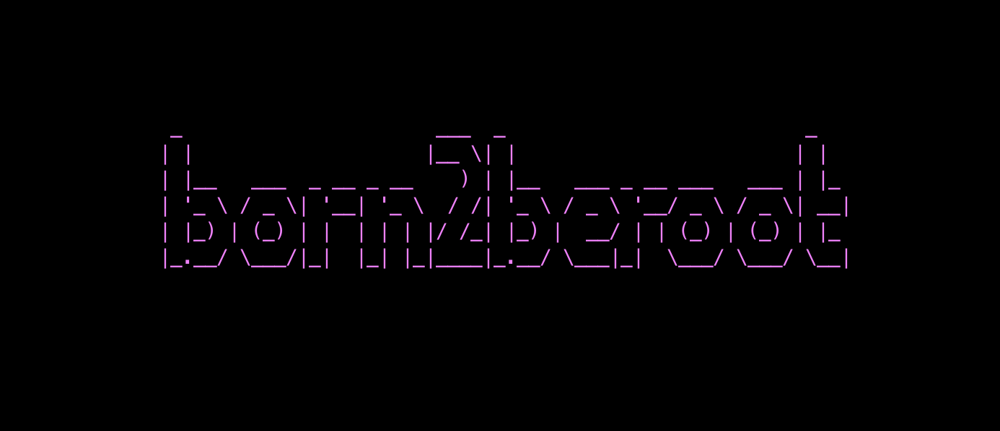
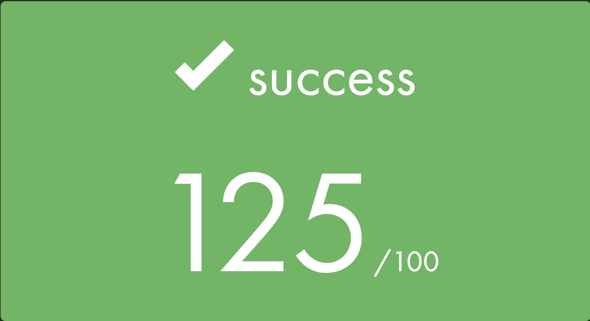

# Born2beroot


:wave:Born2beroot is about creating a local server using virtualbox and debian dis and host a wordpress website on it.

> The subject PDF:
```
https://cdn.intra.42.fr/pdf/pdf/36606/en.subject.pdf
```
### The cammand u need to know:

1. First u need to install debian in virtualbox this is step to do so [Check it out.](https://youtu.be/2w-2MX5QrQw)
2. Commands u will need to know [Check it out.](https://baigal.medium.com/born2beroot-e6e26dfb50ac)
3. More commands [Check it out.](https://github.com/ayoub0x1/born2beroot)

# My final point:
I done the mandatory and the bonus part.



**Thank u for reading have a good one :rocket:**
